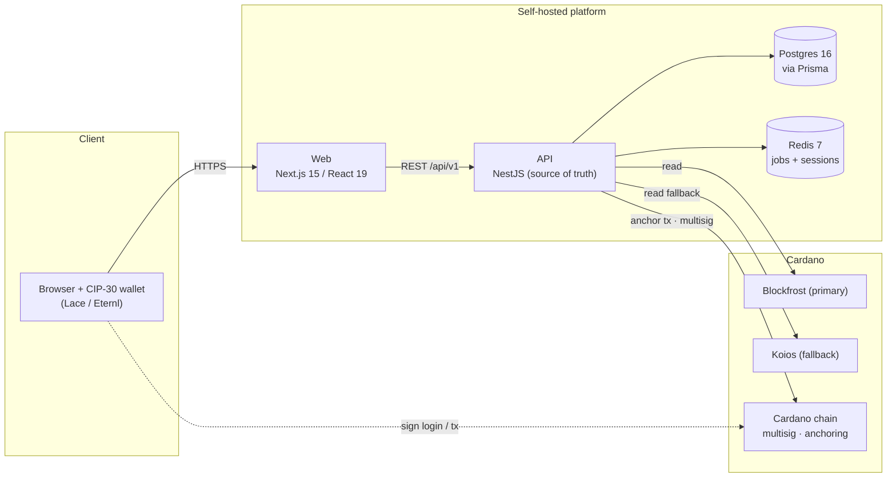
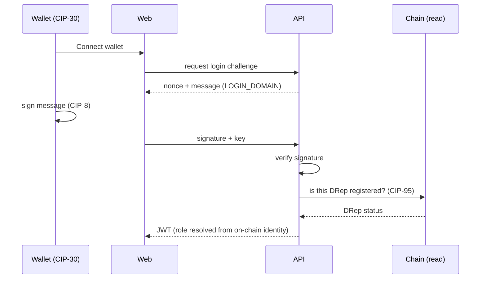
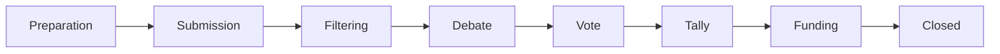

# Architecture

How the Innovation & Growth DAO platform is put together: the components, how a
request flows through them, the data and background work, and the Cardano
integration. For the product-level design rationale see [DESIGN.md](DESIGN.md);
for running it see [DEPLOYMENT.md](DEPLOYMENT.md).

## Core principle — off-chain source of truth, on-chain anchoring

The **backend + Postgres are the authoritative source of truth**. The Cardano
chain is used for exactly five things, and nothing else:

1. **Wallet authentication** — login by signing a message (CIP-30 / CIP-8).
2. **DRep identity** — recognising registered on-chain DReps (CIP-95).
3. **Treasury** — a 3-of-5 native-script multisig holding DAO funds.
4. **Fee / pledge verification** — confirming on-chain payments.
5. **Anchoring** — a daily Merkle-hash of the audit trail, published on-chain so
   anyone can independently verify history.

There is **no Plutus / Aiken on-chain logic**. All governance rules (rounds,
votes, budgets, rewards) run in the application. This keeps the system auditable,
cheap, and fast, while anchoring preserves verifiability.

## System context

## Monorepo layout

A **pnpm workspaces + Turborepo** monorepo:

| Path | Responsibility |
|---|---|
| `apps/web` | Next.js 15 / React 19 frontend. Wallet connection (MeshJS), role-based UI, calls the API. |
| `apps/api` | NestJS backend — the REST API, domain logic, and scheduled jobs. **The source of truth.** |
| `packages/shared` | Framework-agnostic types, enums, role/status constants, platform-config defaults, and **pure logic** (tallies, budget allocation, state classifiers) — imported by both api and web, and unit-tested in isolation. |
| `packages/cardano` | Cardano integration: chain queries, wallet/DRep helpers, transaction + anchoring builders. |
| `packages/db` | Prisma schema, migrations, and seeds. Owns the database contract. |
| `infra` | `docker-compose` for local Postgres + Redis. |
| `tools` | End-to-end test suites (drive the real API against a real DB + Preprod wallets). |

Dependency direction: `web` and `api` depend on `shared`; `api` depends on
`cardano` and `db`; nothing depends on `web` or `api`. Pure domain logic is
pushed down into `shared`/`cardano` so it is testable without a running server.

## Backend (`apps/api`)

A NestJS application. The HTTP API is versioned under **`/api/v1`** (health and
metrics stay unprefixed); every request passes a strict global `ValidationPipe`
(`whitelist` + `forbidNonWhitelisted`), and CORS is restricted to the configured
web origin(s) with credentials.

Modules are organised by domain:

| Area | Modules | What they own |
|---|---|---|
| **Platform** | `prisma`, `redis`, `config`, `health`, `jobs`, `notifications`, `messages` | DB/Redis access, config, health checks, the scheduler, and in-app messaging. |
| **Identity & access** | `auth`, `users`, `drep`, `submitter` | Wallet + admin auth, accounts, DRep/expert registration & admission, submitter applications. |
| **Governance** | `rounds`, `proposals`, `internal-proposals`, `comments`, `governance` | Funding-round lifecycle, proposal review (filtering → D&V → tally → funding/milestones), internal votes, discussion, and platform parameters. |
| **Money** | `treasury`, `rewards`, `merit` | Multisig treasury + signing, reward payouts, and the merit ledger. |
| **Cardano & admin** | `cardano`, `admin` | Wraps `packages/cardano`; platform-admin, genesis board bootstrap. |

### Data layer

- **Postgres 16** via **Prisma** is the system of record. The schema and every
  migration live in `packages/db/prisma`; migrations are applied with
  `prisma migrate deploy` on each release.
- **Redis 7** backs the **BullMQ** job queue and holds a **session denylist**
  (for immediate JWT revocation on logout).

### Background jobs (`jobs` module)

Scheduled work runs on the API on a timer, independent of any request:

- **round stage auto-advance** — move a round to its next stage when the window
  is due and confirmed;
- **quick-poll resolution** — resolve tie-break polls whose window ended (and the
  moment every eligible DRep has voted);
- **merit sweep** — apply missed-vote / missed-review penalties and payout rewards;
- **daily anchoring** — publish the Merkle-hash of the audit trail on-chain;
- **pledge-grace + fee reminders**, and reward calculation.

## Authentication flow

Login is a wallet signature — no passwords for members. Sessions are JWTs; logout
adds the token to the Redis denylist.

A member's **role is derived from on-chain identity**, not assigned in a form:
any wallet is a Viewer; a registered on-chain DRep can join the DAO; board members
are seated DReps. The platform **admin** is a separate account with its own login
and 2FA (always enforced on Mainnet).

## Cardano integration (`packages/cardano`)

- **Reads** go through a query service with **Blockfrost as primary** and
  **Koios as a free fallback**, switched per network (`CARDANO_NETWORK`).
- **Wallet auth** verifies CIP-30/CIP-8 signatures; **DRep identity** uses CIP-95.
- **Treasury** is a **native-script 3-of-5 multisig**; transactions are assembled
  off-chain and signed by board members in a 1-phase or 2-phase ceremony (see
  [MULTISIG-SIGNING.md](MULTISIG-SIGNING.md), [TREASURY.md](TREASURY.md)).
- **Anchoring** hashes the audit trail into a daily transaction from a **separate,
  low-balance hot wallet** (never the treasury) — see
  [ANCHOR-WALLET.md](ANCHOR-WALLET.md) and [ONCHAIN-SOURCE.md](ONCHAIN-SOURCE.md).

## Frontend (`apps/web`)

Next.js 15 / React 19. Connects the wallet via MeshJS, holds the session, and
renders a **role-based UI** (Viewer / Submitter / DRep / Board / Admin) that calls
the versioned REST API. Branding (tab title + icon) is chosen at build time via
`NEXT_PUBLIC_APP_NAME`, so the same code base ships more than one edition.

## Domain model — the funding round

The heart of the platform is the funding round, a sequence of stages a proposal
passes through. Stage transitions and the tie-break maths are pure functions in
`packages/shared` and `apps/api`, unit-tested independently.

- **Filtering** — a jury admits proposals into the round.
- **Debate & Vote** — DReps discuss, then cast balanced-power ballots.
- **Tally** — results are published; proposals tied at the category budget cliff
  are decided by **ranked-priority quick polls** (power-weighted Borda +
  budget-greedy fill).
- **Funding** — milestone-based release, with reviewer assignment, proof-of-
  achievement review, pledge/skin-in-the-game, and stop-funding escalation.

The full parameter set that tunes each stage is in [PARAMETERS.md](PARAMETERS.md);
the end-user walkthrough is in [USER-GUIDE.md](USER-GUIDE.md).

## Key decisions

- **Off-chain source of truth, no on-chain scripts.** Governance runs in the
  application; the chain provides identity, custody and verifiability. Simpler,
  cheaper, auditable — anchoring closes the trust gap.
- **Pure logic extracted from frameworks.** Allocation, tallies and classifiers
  live in `shared`/`api` as plain functions with unit tests, so the money-moving
  maths is verified without a database.
- **Roles from the chain, not from a form.** Identity and eligibility are read
  from Cardano, which is what makes the DAO permissionless by default.
- **One code base, multiple editions.** Branding is a build-time switch, not a
  fork.

## Quality & testing

Static typing (strict TypeScript) is the analysis gate; unit tests cover the pure
logic; end-to-end suites exercise the real API against Postgres + Redis and
Preprod wallets. See [TEST-REPORT.md](TEST-REPORT.md).
